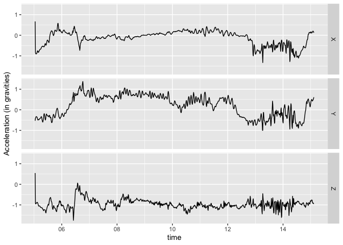
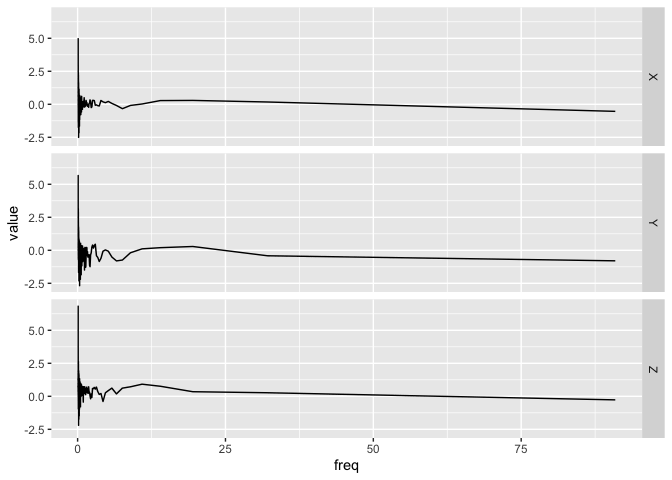

<!-- README.md is generated from README.Rmd. Please edit that file -->

# bis620.2022

<!-- badges: start -->

[](https://github.com/loye16/bis620.2022/actions/workflows/R-CMD-check.yaml)
[](https://github.com/loye16/bis620.2022/actions/workflows/test-coverage.yaml)
[](https://app.codecov.io/gh/loye16/bis620.2022?branch=main)
[](https://github.com/loye16/bis620.2022/actions/workflows/lint.yaml)
<!-- badges: end -->

Accelerometry is a tool used to measure human movement. The goal of
bis620.2022 is to plot accelerometry data with respect to time or
frequency.

This package has two functions, `accel_plot` and `spectral_signature`
(also called with `spec_sig`). The first, `accel_plot`, plots UKBiobank
accelerometry data. It also assumes that the data has columns `time`,
`X`, `Y`, and `Z` column along with either a `time` or `freq` column.
The second, `spectral_signature`, gets the spectral signature of the
accelerometry data calculated by taking the modulus of the Fourier
coefficients of the signal. Users have the choice to take the log of the
modulusand to unnormalized the inverse transform that is computed.

The following are links to the coverage page and lint results.

[Codecov
Results](https://app.codecov.io/gh/loye16/bis620.2022?branch=main)

[Lint
Results](https://github.com/loye16/bis620.2022/actions/workflows/lint.yaml)

## Installation

You can install the development version of bis620.2022 from
[GitHub](https://github.com/) with:

``` r
# install.packages("devtools")
devtools::install_github("loye16/bis620.2022")
```

## Examples

``` r
# packages
library(bis620.2022)
library(ggplot2)

#data
data(ukb_accel)
```

``` r
ukb_accel[1:1000, ] |>
  accel_plot() +
    ylab("Acceleration (in gravities)")
```



``` r
ukb_accel[1:1000, ] |>
  spectral_signature(take_log = TRUE) |>
  accel_plot()
```


